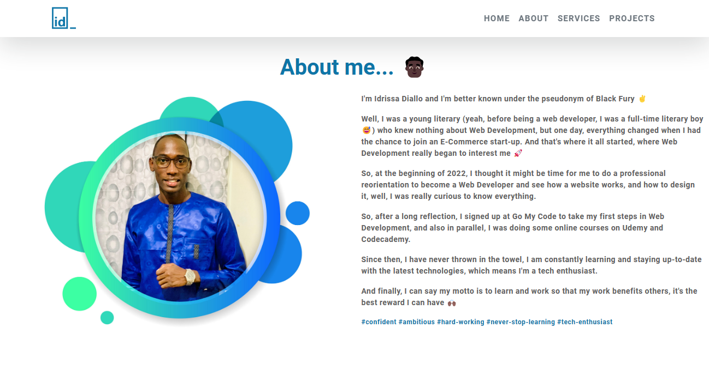
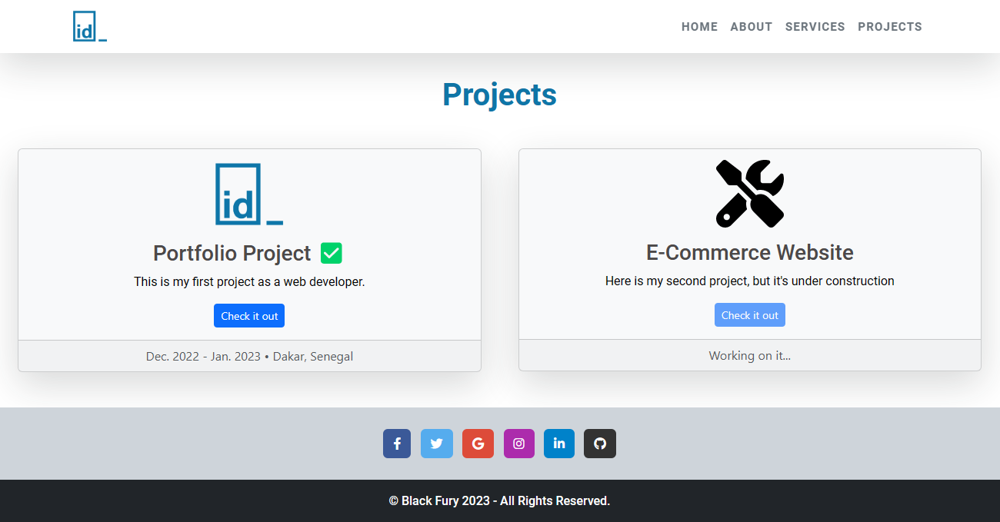

# Black Fury | Personal-website

Welcome to my personal website! This is my very first project as a frontend developer, and I'm excited to share it with you.  

My website is a showcase of my skills and projects as a developer. It features a modern and clean design, with easy navigation and a responsive layout that works well on all devices.  

On the about section, you'll find a brief introduction about me and my journey as a developer, as well as links to my social media profiles and projects.  

I built this website using HTML, CSS, and JavaScript, and with a help of a popular library named Bootstrap. I learned a lot throughout the development process, and I'm excited to continue improving my skills and creating more projects in the future.  

Thank you for visiting <a href="https://blackfury117.github.io/" rel="noopener" target="_blank">my website</a>, and feel free to get in touch with me if you have any questions or feedback.

## Built with

<ul>
    <li>HTML</li>
    <li>CSS</li>
    <li>Bootstrap</li>
    <li>JavaScript</li>
</ul>

## Author

<ul>
<li>Coded by me</li>
</ul>

🌐 Link -- https://blackfury117.github.io